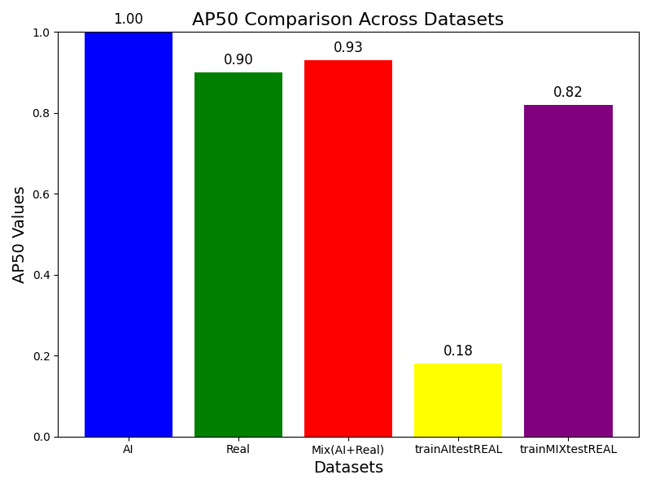

## Results

# AP50 score comparison across datasets

## Overview
This graph compares the **mAP scores** achieved on five dataset combinations for object detection using YOLO. The datasets used are as follows:

- **AI**: Model trained and tested on synthetic images generated using CARLA simulator.
- **Real**: Model trained and tested on real-world images.
- **Mix(AI + Real)**: Model trained and tested on combination of synthetic and real-world images.
- **trainAItestREAL**: Model trained on synthetic images and tested on real-world images.
- **trainMIXtestREAL**: Model trained on mixed data (AI + Real) and tested on real-world images.

## **Results and Analysis**
## mAP Score Comparison Graph

| **Dataset**            | **AP50 Value** |
|------------------------|--------------:|
| **AI**                | 1.00          |
| **Real**              | 0.90          |
| **Mix (AI + Real)**   | 0.93          |
| **trainAItestREAL**   | 0.18          |
| **trainMIXtestREAL**  | 0.82          |
