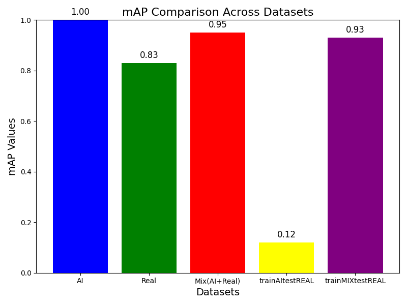

# mAP_0.5 Score Comparison Across Datasets

## Overview
This graph compares the **mAP scores** achieved on five dataset combinations for object detection using YOLO. The datasets used are as follows:

- **AI**: Model trained and tested on synthetic images generated using CARLA simulator.
- **Real**: Model trained and tested on real-world images.
- **Mix(AI + Real)**: Model trained and tested on combination of synthetic and real-world images.
- **trainAItestREAL**: Model trained on synthetic images and tested on real-world images.
- **trainMIXtestREAL**: Model trained on mixed data (AI + Real) and tested on real-world images.

---
## **Results and Analysis**
## mAP Score Comparison Graph

---

| **Dataset**            | **mAP Value** |
|------------------------|--------------:|
| **AI**                | 1.00          |
| **Real**              | 0.83          |
| **Mix (AI + Real)**   | 0.95          |
| **trainAItestREAL**   | 0.12          |
| **trainMIXtestREAL**  | 0.93          |

---

## Key Observations
1. **AI Dataset**:
   - Achieved the highest mAP score (**1.00**) when trained and tested on synthetic data.

2. **Real Dataset**:
   - Real-world data alone achieved an mAP score of **0.83**.

3. **Mix (AI + Real)**:
   - Combining synthetic and real data improved the score to **0.95**, showcasing the value of mixed datasets.

4. **trainAItestREAL Dataset**:
   - Model trained on synthetic data performed poorly (**0.12**) when tested on real-world images. This highlights poor cross-domain generalization.

5. **trainMIXtestREAL Dataset**:
   - Training on mixed data and testing on real-world images achieved a strong mAP score of **0.93**, indicating effective generalization.

---

## Conclusion
- Training with **Mix (AI + Real)** datasets provides the best performance (**0.95**), closely followed by **trainMIXtestREAL** (**0.93**).
- Models trained solely on **AI** perform exceptionally well in synthetic conditions (**1.00**), but generalize poorly to real data (**0.12** when tested on Real).
-Model trained and tested on **REAL** gives a score of **0.83** but score improved when AI images are added - **trainMIXtestREAL** (**0.93**).
-The improvement from 0.83 to 0.93 demonstrates that AI-generated data can be a valuable augmentation strategy, particularly when real-world data is scarce or lacks diversity. This approach enhances the model's ability to perform well on real-world datasets by improving its generalization and robustness.

---

